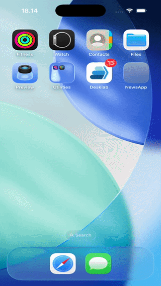

# NewsApp



A modular SwiftUI news reader application implemented using **MVVM architecture** and **Swift Package Manager (SPM) modularization**.

This repository demonstrates a **production-oriented project structure** with separate modules for core utilities, design systems, feature implementations, and the main application layer.

It is intended as a **clean and scalable starting point** for building SwiftUI applications with reusable modules, testable view models, and maintainable architecture.

---

# Key Features

- SwiftUI front-end using the **MVVM presentation pattern**
- **Modular architecture** using Swift Package Manager
- Clear separation of concerns between **Core, DesignSystem, and Feature modules**
- Local JSON resources used as mock article data (offline/demo)
- Prepared structure for **Unit Tests and UI Tests**

---

# Architecture Overview

The project follows **MVVM layered architecture** with additional abstraction layers to improve scalability and testability.

## Layer Responsibilities

### Models / Entities

Immutable domain data structures representing business objects.

Example:

- `NewsArticle`

### Use Cases

Contain **business logic** and orchestrate repositories to perform domain operations.

Example:

- `FetchArticlesUseCase`

### Repositories

Responsible for **data access abstraction**.

Repositories can retrieve data from:

- API
- Local database
- Local JSON
- Cache

Example:

- `NewsRepository`

### ViewModels

Observable objects responsible for:

- Managing UI state
- Handling presentation logic
- Invoking use cases
- Preparing data for the UI

Example:

- `NewsListViewModel`

### Views (SwiftUI)

Declarative UI components bound to ViewModels.

Example:

- `NewsListPage`
- `ArticleDetailPage`

---

# Modular Structure

The project is divided into several modules to maintain **clear boundaries and reusability**.

### Core

Shared utilities and primitives used across modules.

Examples:

- Navigation protocol
- HTTP client protocol
- Base response models
- Logging utilities
- Common extensions

Path: **Modules/Core**

---

### DesignSystem

Reusable UI components and application styling.

Examples:

- Color system
- Typography
- Reusable UI components
- Loading indicators
- Toast views
- Skeleton/Shimmer views

Path: **Modules/DesignSystem**

---

### News

Feature module containing the **news domain logic**.

Includes:

- Entities
- Repositories
- Use Cases
- ViewModels
- SwiftUI pages

Examples:

- `NewsListPage`
- `ArticleDetailPage`

Path: **Modules/News**

---

### NewsApp

Main application target responsible for:

- Application entry point
- Module composition
- Global navigation

Example files:

- `NewsApp.swift`
- `RootView.swift`

---

# Extensibility

The modular structure allows easy expansion.

### Additional Platforms

New application targets can be added:

- macOS App
- iPadOS App
- watchOS App
- tvOS App

### Additional Features

New feature modules can also be added such as:

- `Profile`
- `Settings`
- `Bookmarks`
- `Authentication`

---

# Requirements

- MacOS
- Xcode
- Swift (bundled with Xcode)
- Swift Package Manager (bundled with Xcode)

---

# Opening the Project

Open the `NewsApp.xcworkspace` file to ensure Swift packages and local modules are properly linked.

---

# Build & Run

1. Open the workspace in Xcode.
2. Select the **NewsApp** scheme.
3. Choose a simulator device.
4. Run the application: `Cmd + R`

---

# Possible Improvements

## Protocol Usage

Protocols are widely used across layers such as:

- **Use Cases**
- **Repositories**
- **Services**
- **ViewModels**

This approach provides several benefits:

- Easier **mocking** during unit testing
- Better **dependency inversion**
- Improved **testability**
- Flexible **implementation swapping**

Example:

```swift
protocol NewsRepositoryProtocol {
    func fetchArticles() async throws -> [NewsArticle]
}
```

Concrete implementations can then be replaced with mock repositories during testing.

---

## Dependency Injection

Dependency Injection can be implemented using Swinject.

Swinject provides:

- Centralized dependency registration
- Automatic object resolution
- Loose coupling between modules

Example:

```swift
container.register(NewsRepositoryProtocol.self) { _ in
    NewsRepository()
}

container.register(FetchArticlesUseCase.self) { resolver in
    FetchArticlesUseCase(
        repository: resolver.resolve(NewsRepositoryProtocol.self)!
    )
}
```

This allows the application to **resolve dependencies dynamically** and improves maintainability.

---

## Unit Test Implementation

By utilizing protocol-based abstractions, writing unit tests becomes significantly easier.

External dependencies such as:

- API services
- Third-party libraries
- Database calls

can be replaced with **mock implementations**.

Example:

```swift
class MockNewsRepository: NewsRepositoryProtocol {
    func fetchArticles() async throws -> [NewsArticle] {
        return MockData.articles
    }
}
```

This enables:

- Fast unit tests
- Deterministic results
- Isolation of business logic

---

## Base Classes (Base...)

Base classes can be introduced to reduce duplicated logic across modules.

Examples include:

### BaseViewModel

Common functionality:

- Loading state
- Error handling
- Task cancellation

Example:

```swift
class BaseViewModel: ObservableObject {
    @Published var isLoading: Bool = false
    @Published var errorMessage: String?
}
```

---

### BaseService

Shared network functionality such as:

- Request building
- Response decoding
- Error handling
- Logging

---

Reusable patterns for:

- Data mapping
- Error transformation
- API handling

---

Using base classes together with protocols enables:

- Code reuse
- Consistent patterns
- Cleaner implementations

---

## Environment Targets

Additional build configurations can be introduced to support multiple environments such as:

- `Development (dev)`
- `UAT (User Acceptance Testing)`
- `Production`

Benefits of having multiple targets include:

- Connecting to different API environments
- Testing experimental features safely
- Separating internal testing builds from production releases
- Managing environment-specific configurations (API base URLs, feature flags, analytics keys, etc.)

These configurations can then be mapped to different **Xcode schemes** to easily switch between environments.

---

## Essential UI Components

To make the application more production-ready, several essential UI components can be added.

### Splash Screen

A splash screen can be implemented to:

- Display branding while the app initializes
- Load initial resources
- Perform early setup tasks (configuration, analytics, etc.)
